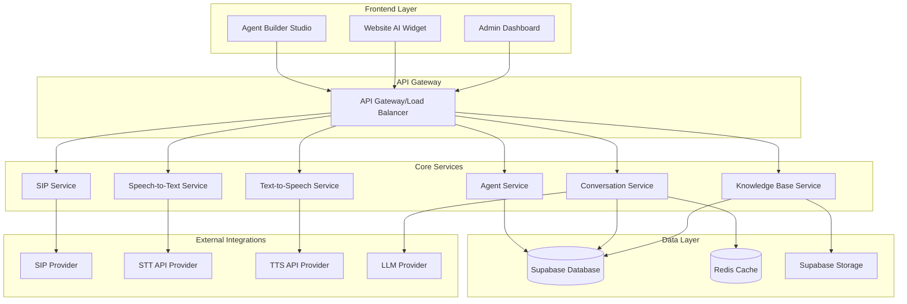
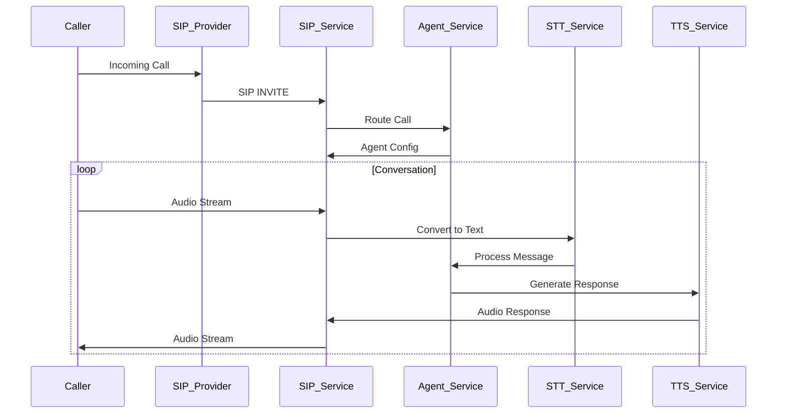

# Design Document

## Overview

The AI Agent Creator Platform is designed as a modular system with three core components: an Agent Builder Studio for creating and configuring AI agents, a Website AI Widget for embedding chat and voice capabilities into websites, and a SIP Integration system for handling inbound and outbound phone calls. The platform follows a microservices architecture to ensure scalability and maintainability.

## Architecture

### High-Level Architecture



### Technology Stack

- **Frontend**: React.js with TypeScript for web interfaces
- **Backend**: Node.js with Express.js for API services
- **Database**: Supabase (PostgreSQL) for persistent data storage with built-in APIs
- **Authentication**: Supabase Auth for user management and security
- **File Storage**: Supabase Storage for knowledge base documents and audio files
- **Cache**: Redis for session management and real-time data
- **Real-time Communication**: WebRTC for browser-based voice, SIP.js for telephony
- **Message Queue**: Redis Pub/Sub for service communication
- **Containerization**: Docker for service deployment

## Components and Interfaces

### 1. Agent Builder Studio

**Purpose**: Web-based interface for creating and configuring AI agents

**Key Features**:
- Visual agent configuration interface
- Personality and tone selection
- Knowledge base management (document upload, URL ingestion)
- Basic workflow configuration
- Widget and SIP deployment settings

**API Endpoints**:
```
POST /api/agents - Create new agent
GET /api/agents/:id - Get agent configuration
PUT /api/agents/:id - Update agent configuration
DELETE /api/agents/:id - Delete agent
POST /api/agents/:id/knowledge-base - Upload knowledge base content
GET /api/agents/:id/deployments - Get deployment configurations
```

### 2. Website AI Widget

**Purpose**: Embeddable JavaScript widget providing chat and voice capabilities

**Key Features**:
- Chat interface with message history
- Voice input/output with push-to-talk and continuous listening modes
- Responsive design for mobile and desktop
- Customizable appearance and branding
- Real-time conversation processing

**Integration Method**:
```html
<script src="https://cdn.aiagent.com/widget.js" 
        data-agent-id="agent_123" 
        data-theme="light"
        data-position="bottom-right">
</script>
```

**Widget API**:
```javascript
// Widget initialization and control
window.AIWidget.init(config);
window.AIWidget.show();
window.AIWidget.hide();
window.AIWidget.sendMessage(message);
```

### 3. SIP Integration Service

**Purpose**: Handle inbound and outbound phone calls using SIP protocol

**Key Features**:
- SIP registration and connection management
- Inbound call routing to appropriate agents
- Outbound call initiation and management
- Call recording and transcription
- Call transfer capabilities

**SIP Flow**:


### 4. Conversation Service

**Purpose**: Core conversation processing and context management

**Key Features**:
- Message processing and routing
- Conversation context management
- Integration with LLM providers
- Response generation and formatting
- Session management

**API Endpoints**:
```
POST /api/conversations - Start new conversation
POST /api/conversations/:id/messages - Send message
GET /api/conversations/:id - Get conversation history
PUT /api/conversations/:id/context - Update conversation context
```

### 5. Speech Services

**STT Service**:
- Real-time speech-to-text conversion
- Support for multiple audio formats
- Noise reduction and audio preprocessing
- Integration with providers like OpenAI Whisper, Google Speech-to-Text

**TTS Service**:
- Text-to-speech conversion with natural voices
- Voice selection and customization
- Audio format optimization for web and telephony
- Integration with providers like ElevenLabs, OpenAI TTS

## Data Models

### Agent Configuration
```typescript
interface AgentConfig {
  id: string;
  name: string;
  description: string;
  personality: {
    tone: 'professional' | 'friendly' | 'casual' | 'formal';
    style: string;
    instructions: string;
  };
  knowledgeBase: {
    documents: Document[];
    urls: string[];
    faqs: FAQ[];
  };
  settings: {
    responseTime: number;
    maxConversationLength: number;
    escalationTriggers: string[];
  };
  deployments: {
    widget: WidgetConfig;
    sip: SipConfig;
  };
  createdAt: Date;
  updatedAt: Date;
}
```

### Conversation Session
```typescript
interface ConversationSession {
  id: string;
  agentId: string;
  channel: 'widget' | 'sip';
  userId?: string;
  phoneNumber?: string;
  messages: Message[];
  context: ConversationContext;
  status: 'active' | 'ended' | 'transferred';
  startedAt: Date;
  endedAt?: Date;
  metadata: {
    userAgent?: string;
    ipAddress?: string;
    callId?: string;
  };
}
```

### Message
```typescript
interface Message {
  id: string;
  conversationId: string;
  role: 'user' | 'agent';
  content: string;
  type: 'text' | 'audio';
  audioUrl?: string;
  transcription?: string;
  timestamp: Date;
  metadata: {
    confidence?: number;
    processingTime?: number;
  };
}
```

### Widget Configuration
```typescript
interface WidgetConfig {
  agentId: string;
  appearance: {
    theme: 'light' | 'dark' | 'custom';
    primaryColor: string;
    position: 'bottom-right' | 'bottom-left' | 'top-right' | 'top-left';
    size: 'small' | 'medium' | 'large';
  };
  behavior: {
    autoOpen: boolean;
    greeting: string;
    placeholder: string;
    voiceEnabled: boolean;
    pushToTalk: boolean;
  };
  branding: {
    logo?: string;
    companyName: string;
    showPoweredBy: boolean;
  };
}
```

### SIP Configuration
```typescript
interface SipConfig {
  agentId: string;
  provider: {
    host: string;
    port: number;
    username: string;
    password: string;
    realm: string;
  };
  numbers: {
    inbound: string[];
    outbound: string;
  };
  settings: {
    recordCalls: boolean;
    maxCallDuration: number;
    transferEnabled: boolean;
    transferNumber?: string;
  };
}
```

## Error Handling

### Error Categories
1. **Validation Errors**: Invalid input data or configuration
2. **Authentication Errors**: Unauthorized access attempts
3. **Service Errors**: External service failures (STT, TTS, LLM)
4. **Network Errors**: Connection failures and timeouts
5. **Resource Errors**: Rate limiting and quota exceeded

### Error Response Format
```typescript
interface ErrorResponse {
  error: {
    code: string;
    message: string;
    details?: any;
    timestamp: Date;
    requestId: string;
  };
}
```

### Retry and Fallback Strategies
- **STT/TTS Services**: Automatic retry with exponential backoff, fallback to alternative providers
- **LLM Services**: Circuit breaker pattern, fallback to cached responses
- **SIP Connections**: Automatic reconnection with configurable retry intervals
- **Database Operations**: Connection pooling with automatic failover

## Testing Strategy

### Unit Testing
- Service layer business logic
- Data model validation
- Utility functions and helpers
- API endpoint handlers

### Integration Testing
- Supabase database operations and RLS policies
- External service integrations (STT, TTS, LLM)
- SIP provider connectivity
- Widget embedding and functionality
- Supabase Auth integration

### End-to-End Testing
- Complete conversation flows through widget
- Inbound and outbound call scenarios
- Agent configuration and deployment workflows
- Multi-user conversation handling

### Performance Testing
- Concurrent conversation handling
- Voice processing latency
- Database query optimization
- Widget loading and responsiveness

### Security Testing
- Authentication and authorization
- Data encryption validation
- Input sanitization and validation
- Rate limiting effectiveness

## Deployment and Scalability

### Container Architecture
- Each service deployed as separate Docker container
- Kubernetes orchestration for scaling and management
- Load balancing for high availability
- Health checks and automatic recovery

### Scaling Considerations
- Horizontal scaling for conversation and SIP services
- Supabase built-in scaling and read replicas
- CDN for widget JavaScript delivery
- Redis clustering for session management
- Supabase Edge Functions for serverless scaling

### Monitoring and Observability
- Application performance monitoring (APM)
- Real-time conversation metrics
- SIP connection health monitoring
- Error tracking and alerting
- Usage analytics and reporting