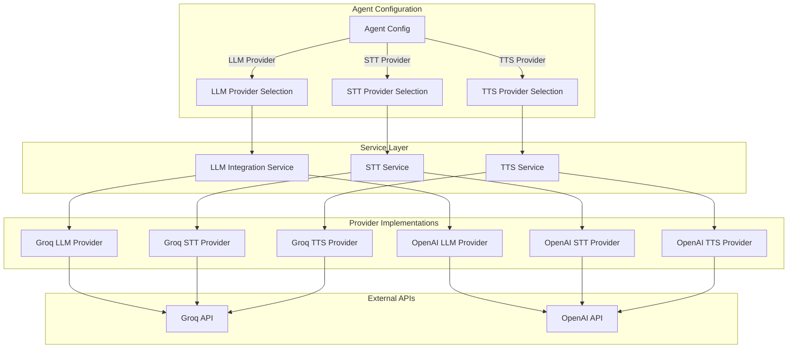

# Groq Provider Integration - Design Document

## Overview

This design document outlines the architecture and implementation approach for integrating Groq as a multi-modal AI provider into the AI Agent Creator Platform. The integration follows the existing provider pattern established for OpenAI, ensuring consistency and maintainability while leveraging Groq's high-performance inference capabilities.

### Key Design Principles

1. **Provider Abstraction**: Maintain existing provider interfaces to ensure seamless integration
2. **Independent Service Configuration**: Allow users to mix and match providers across LLM, STT, and TTS
3. **Graceful Degradation**: Implement fallback mechanisms when Groq services are unavailable
4. **Performance Optimization**: Leverage Groq's high token throughput for improved user experience
5. **Cost Transparency**: Track and display usage metrics for cost estimation

## Architecture

### High-Level Architecture



### Provider Factory Pattern

The system will use a factory pattern to instantiate the appropriate provider based on agent configuration:

```typescript
interface ProviderFactory {
  createLLMProvider(config: LLMProviderConfig): LLMProvider;
  createSTTProvider(config: STTProviderConfig): STTProvider;
  createTTSProvider(config: TTSProviderConfig): TTSProvider;
}
```

## Components and Interfaces

### 1. Groq LLM Provider

**File**: `packages/backend/src/services/providers/groqLLMProvider.ts`

**Responsibilities**:
- Implement LLM provider interface for Groq API
- Handle chat completions with function calling support
- Manage rate limiting and retries
- Convert between internal message format and Groq API format

**Key Methods**:
```typescript
class GroqLLMProvider implements LLMProvider {
  constructor(apiKey: string, config?: GroqLLMConfig);
  
  async generateResponse(
    messages: LLMMessage[],
    config: LLMConfig,
    context: FunctionContext
  ): Promise<LLMResponse>;
  
  async generateStreamingResponse(
    messages: LLMMessage[],
    config: LLMConfig,
    context: FunctionContext
  ): AsyncGenerator<LLMStreamChunk>;
  
  getAvailableModels(): GroqModel[];
  validateConfig(config: LLMConfig): boolean;
  estimateCost(usage: TokenUsage, model: string): number;
}
```

**Supported Models**:
- `llama-3.1-8b-instant`: 560 TPS, 131K context, $0.05/$0.08 per 1M tokens
- `llama-3.3-70b-versatile`: 280 TPS, 131K context, $0.59/$0.79 per 1M tokens
- `openai/gpt-oss-120b`: 500 TPS, 131K context, $0.15/$0.60 per 1M tokens
- `openai/gpt-oss-20b`: 1000 TPS, 131K context, $0.075/$0.30 per 1M tokens

**Rate Limits** (Developer Plan):
- 250K-300K tokens per minute
- 1K requests per minute

### 2. Groq STT Provider

**File**: `packages/backend/src/services/providers/groqSTTProvider.ts`

**Responsibilities**:
- Implement STT provider interface for Groq Whisper API
- Handle audio transcription with timestamp support
- Validate audio format and size constraints
- Provide language detection and confidence scores

**Key Methods**:
```typescript
class GroqSTTProvider implements STTProvider {
  constructor(apiKey: string, config?: GroqSTTConfig);
  
  async transcribe(
    audioBuffer: Buffer,
    options?: STTOptions
  ): Promise<STTResult>;
  
  async transcribeStream(
    audioStream: Readable,
    options?: STTOptions
  ): Promise<STTResult>;
  
  getSupportedFormats(): string[];
  getMaxFileSize(): number;
  getAvailableModels(): string[];
}
```

**Supported Models**:
- `whisper-large-v3`: Standard Whisper model, $0.111 per hour
- `whisper-large-v3-turbo`: Faster variant, $0.04 per hour

**Constraints**:
- Max file size: 100MB
- Supported formats: mp3, mp4, mpeg, mpga, m4a, wav, webm
- Rate limits: 200K-400K audio seconds per hour, 300-400 RPM

### 3. Groq TTS Provider

**File**: `packages/backend/src/services/providers/groqTTSProvider.ts`

**Responsibilities**:
- Implement TTS provider interface for Groq PlayAI API
- Handle text-to-speech synthesis with voice selection
- Support streaming audio generation
- Manage text chunking for long inputs

**Key Methods**:
```typescript
class GroqTTSProvider implements TTSProvider {
  constructor(apiKey: string, config?: GroqTTSConfig);
  
  async synthesize(
    text: string,
    options?: TTSOptions
  ): Promise<TTSResult>;
  
  async synthesizeStream(
    text: string,
    options?: TTSOptions
  ): Promise<Readable>;
  
  getAvailableVoices(): Promise<string[]>;
  getSupportedFormats(): string[];
  getMaxTextLength(): number;
}
```

**Supported Models**:
- `playai-tts`: Standard English TTS
- `playai-tts-arabic`: Arabic language TTS

**Constraints**:
- Max context: 8,192 characters
- Pricing: $50.00 per 1M characters
- Rate limits: 50K TPM, 250 RPM

### 4. Provider Configuration Service

**File**: `packages/backend/src/services/providerConfig.ts`

**Responsibilities**:
- Manage provider selection and configuration
- Validate provider availability and credentials
- Instantiate appropriate providers based on agent config
- Handle provider fallback logic

**Key Methods**:
```typescript
class ProviderConfigService {
  async getProviderForAgent(
    agentId: string,
    serviceType: 'llm' | 'stt' | 'tts'
  ): Promise<Provider>;
  
  async updateAgentProvider(
    agentId: string,
    serviceType: 'llm' | 'stt' | 'tts',
    providerName: string,
    config: ProviderConfig
  ): Promise<void>;
  
  async validateProvider(
    providerName: string,
    serviceType: string
  ): Promise<boolean>;
  
  getAvailableProviders(serviceType: string): ProviderInfo[];
}
```

### 5. Groq Client Wrapper

**File**: `packages/backend/src/services/providers/groqClient.ts`

**Responsibilities**:
- Centralize Groq API communication
- Handle authentication and request signing
- Implement rate limiting and retry logic
- Provide error handling and logging

**Key Methods**:
```typescript
class GroqClient {
  constructor(apiKey: string);
  
  async chatCompletion(params: ChatCompletionParams): Promise<ChatCompletionResponse>;
  async transcribeAudio(params: TranscriptionParams): Promise<TranscriptionResponse>;
  async synthesizeSpeech(params: SynthesisParams): Promise<SynthesisResponse>;
  
  private async makeRequest<T>(
    endpoint: string,
    method: string,
    body?: any,
    headers?: Record<string, string>
  ): Promise<T>;
  
  private handleRateLimit(retryAfter: number): Promise<void>;
  private handleError(error: any): Error;
}
```

## Data Models

### Agent Configuration Extension

Add provider configuration fields to the agents table:

```sql
ALTER TABLE agents ADD COLUMN llm_provider VARCHAR(50) DEFAULT 'openai';
ALTER TABLE agents ADD COLUMN llm_model VARCHAR(100);
ALTER TABLE agents ADD COLUMN llm_config JSONB DEFAULT '{}';

ALTER TABLE agents ADD COLUMN stt_provider VARCHAR(50) DEFAULT 'openai';
ALTER TABLE agents ADD COLUMN stt_model VARCHAR(100);
ALTER TABLE agents ADD COLUMN stt_config JSONB DEFAULT '{}';

ALTER TABLE agents ADD COLUMN tts_provider VARCHAR(50) DEFAULT 'openai';
ALTER TABLE agents ADD COLUMN tts_model VARCHAR(100);
ALTER TABLE agents ADD COLUMN tts_config JSONB DEFAULT '{}';
```

### Provider Configuration Schema

```typescript
interface ProviderConfig {
  provider: 'openai' | 'groq' | 'elevenlabs';
  model: string;
  config: {
    temperature?: number;
    maxTokens?: number;
    topP?: number;
    frequencyPenalty?: number;
    presencePenalty?: number;
    // Provider-specific options
    [key: string]: any;
  };
}

interface GroqLLMConfig {
  model: string;
  temperature?: number;
  maxTokens?: number;
  topP?: number;
  stop?: string[];
  stream?: boolean;
}

interface GroqSTTConfig {
  model: 'whisper-large-v3' | 'whisper-large-v3-turbo';
  language?: string;
  prompt?: string;
  temperature?: number;
  responseFormat?: 'json' | 'text' | 'verbose_json';
}

interface GroqTTSConfig {
  model: 'playai-tts' | 'playai-tts-arabic';
  voice?: string;
  speed?: number;
  format?: string;
}
```

### Usage Tracking Schema

```typescript
interface ProviderUsage {
  id: string;
  agentId: string;
  conversationId: string;
  provider: string;
  serviceType: 'llm' | 'stt' | 'tts';
  model: string;
  timestamp: Date;
  
  // LLM specific
  promptTokens?: number;
  completionTokens?: number;
  totalTokens?: number;
  
  // STT specific
  audioDuration?: number;
  audioSize?: number;
  
  // TTS specific
  characterCount?: number;
  audioGenerated?: number;
  
  // Common
  latencyMs: number;
  cost: number;
  success: boolean;
  errorMessage?: string;
}
```

## Error Handling

### Error Types

```typescript
enum GroqErrorType {
  AUTHENTICATION_ERROR = 'authentication_error',
  RATE_LIMIT_ERROR = 'rate_limit_error',
  INVALID_REQUEST = 'invalid_request',
  MODEL_NOT_FOUND = 'model_not_found',
  CONTEXT_LENGTH_EXCEEDED = 'context_length_exceeded',
  SERVER_ERROR = 'server_error',
  NETWORK_ERROR = 'network_error'
}

class GroqError extends Error {
  constructor(
    public type: GroqErrorType,
    public message: string,
    public statusCode?: number,
    public retryable: boolean = false
  ) {
    super(message);
  }
}
```

### Retry Strategy

```typescript
interface RetryConfig {
  maxAttempts: number;
  initialDelayMs: number;
  maxDelayMs: number;
  backoffMultiplier: number;
  retryableErrors: GroqErrorType[];
}

const DEFAULT_RETRY_CONFIG: RetryConfig = {
  maxAttempts: 3,
  initialDelayMs: 1000,
  maxDelayMs: 10000,
  backoffMultiplier: 2,
  retryableErrors: [
    GroqErrorType.RATE_LIMIT_ERROR,
    GroqErrorType.SERVER_ERROR,
    GroqErrorType.NETWORK_ERROR
  ]
};
```

### Circuit Breaker Pattern

```typescript
class CircuitBreaker {
  private failureCount: number = 0;
  private lastFailureTime: number = 0;
  private state: 'closed' | 'open' | 'half-open' = 'closed';
  
  constructor(
    private threshold: number = 5,
    private timeout: number = 60000 // 1 minute
  ) {}
  
  async execute<T>(fn: () => Promise<T>): Promise<T> {
    if (this.state === 'open') {
      if (Date.now() - this.lastFailureTime > this.timeout) {
        this.state = 'half-open';
      } else {
        throw new Error('Circuit breaker is open');
      }
    }
    
    try {
      const result = await fn();
      this.onSuccess();
      return result;
    } catch (error) {
      this.onFailure();
      throw error;
    }
  }
  
  private onSuccess(): void {
    this.failureCount = 0;
    this.state = 'closed';
  }
  
  private onFailure(): void {
    this.failureCount++;
    this.lastFailureTime = Date.now();
    
    if (this.failureCount >= this.threshold) {
      this.state = 'open';
    }
  }
}
```

## Testing Strategy

### Unit Tests

1. **Provider Implementation Tests**
   - Test each provider method with valid inputs
   - Test error handling for invalid inputs
   - Test rate limiting behavior
   - Test retry logic
   - Mock Groq API responses

2. **Configuration Service Tests**
   - Test provider selection logic
   - Test configuration validation
   - Test fallback mechanisms
   - Test provider instantiation

3. **Client Wrapper Tests**
   - Test request formatting
   - Test response parsing
   - Test error handling
   - Test authentication

### Integration Tests

1. **End-to-End Provider Tests**
   - Test LLM generation with real Groq API
   - Test STT transcription with sample audio
   - Test TTS synthesis with sample text
   - Test function calling flow
   - Test streaming responses

2. **Multi-Provider Tests**
   - Test mixed provider configurations
   - Test provider switching
   - Test fallback scenarios

3. **Performance Tests**
   - Measure response latency
   - Test concurrent request handling
   - Verify rate limit compliance
   - Test under load conditions

### Mock Providers

Create mock implementations for testing without API calls:

```typescript
class MockGroqLLMProvider implements LLMProvider {
  async generateResponse(
    messages: LLMMessage[],
    config: LLMConfig,
    context: FunctionContext
  ): Promise<LLMResponse> {
    return {
      content: 'Mock response from Groq LLM',
      finishReason: 'stop',
      usage: {
        promptTokens: 10,
        completionTokens: 20,
        totalTokens: 30
      }
    };
  }
  // ... other methods
}
```

## Performance Considerations

### Optimization Strategies

1. **Connection Pooling**: Reuse HTTP connections to Groq API
2. **Request Batching**: Batch multiple requests when possible
3. **Caching**: Cache model metadata and configuration
4. **Streaming**: Use streaming for real-time responses
5. **Parallel Processing**: Process independent requests concurrently

### Monitoring Metrics

- Request latency (p50, p95, p99)
- Token throughput
- Error rates by type
- Rate limit utilization
- Cost per request
- Provider availability

## Security Considerations

1. **API Key Management**
   - Store API keys in environment variables
   - Never log or expose API keys
   - Rotate keys periodically
   - Use separate keys for dev/staging/prod

2. **Input Validation**
   - Validate all user inputs before sending to Groq
   - Sanitize text inputs to prevent injection
   - Validate audio file types and sizes
   - Enforce rate limits per user/agent

3. **Data Privacy**
   - Do not send PII to Groq without user consent
   - Implement data retention policies
   - Log only necessary information
   - Comply with GDPR and other regulations

## Migration Strategy

### Phase 1: Infrastructure Setup
1. Add Groq provider implementations
2. Update database schema
3. Add environment configuration
4. Implement provider factory

### Phase 2: Backend Integration
1. Integrate Groq providers into services
2. Add provider selection logic
3. Implement fallback mechanisms
4. Add usage tracking

### Phase 3: Frontend Updates
1. Add provider selection UI
2. Display available models
3. Show cost estimates
4. Add provider status indicators

### Phase 4: Testing and Rollout
1. Test with internal agents
2. Beta test with select users
3. Monitor performance and costs
4. Full rollout to all users

## Rollback Plan

If issues arise during deployment:

1. **Immediate**: Disable Groq provider selection in UI
2. **Short-term**: Revert to OpenAI for all affected agents
3. **Long-term**: Fix issues and re-enable gradually

## Future Enhancements

1. **Additional Groq Models**: Support preview models and systems (Compound, Llama 4)
2. **Advanced Features**: Implement Groq-specific optimizations
3. **Cost Optimization**: Implement intelligent model selection based on query complexity
4. **Multi-Region**: Support Groq's regional endpoints for lower latency
5. **Batch Processing**: Implement batch API support when available
